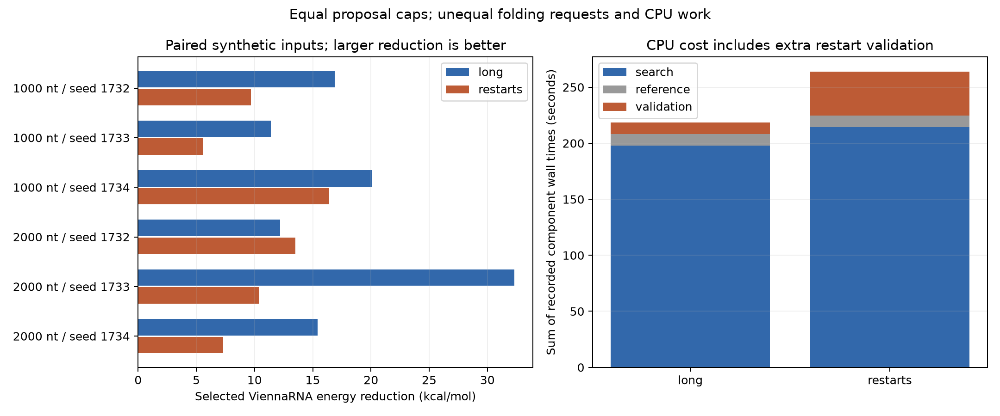

# Audited equal-budget CPU costs

Source study: `/home/zyliu/Documents/rna-stable-ai/results/equal_budget_runs/20261005T042508.068755Z`

Both arms have the same proposed-mutation cap. Restarts have extra baseline folds and candidate validations.

| Arm | Searches | Attempted / planned proposals | Baseline requests | Proposal requests | Reference requests | Candidate validation requests | Search seconds | Reference seconds | Validation seconds |
|---|---:|---:|---:|---:|---:|---:|---:|---:|---:|
| long | 6 | 192/192 | 6 | 192 | 6 | 6 | 197.699 | 10.361 | 10.411 |
| restarts | 24 | 192/192 | 24 | 192 | 6 | 23 | 214.396 | 10.435 | 39.067 |

Sum of search (including baseline), nonreused input references and finalist validations; excludes plotting/reporting/driver overhead. One observation per request; no speedup claim.

Requests are calls to folding adapters. An unavailable tool can receive a request without spawning a process. Missing costs remain unknown; failed validations are excluded from paired energy outcomes. This small synthetic study does not establish biological stability or generalization to 5,000/10,000 nt. No training.
