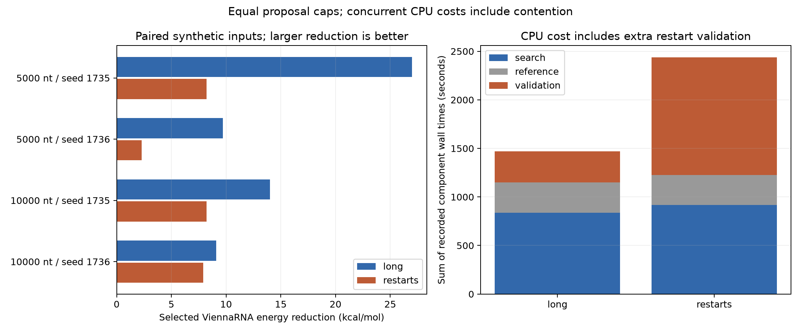

# Audited equal-budget CPU costs

Source study: `/home/zyliu/Documents/rna-stable-ai/results/equal_budget_batch_runs/20261005T045331.190725Z`

Both arms have the same proposed-mutation cap. Restarts have extra baseline folds and candidate validations.

| Arm | Searches | Attempted / planned proposals | Baseline requests | Proposal requests | Reference requests | Candidate validation requests | Search seconds | Reference seconds | Validation seconds |
|---|---:|---:|---:|---:|---:|---:|---:|---:|---:|
| long | 4 | 128/128 | 4 | 128 | 4 | 4 | 836.561 | 314.229 | 318.832 |
| restarts | 16 | 128/128 | 16 | 128 | 4 | 16 | 915.419 | 309.715 | 1212.565 |

Sum of search (including baseline), nonreused input references and finalist validations; excludes plotting/reporting/driver overhead. One observation per request; no speedup claim. Concurrent CPU wall times include contention; not isolated benchmark timing.

Requests are calls to folding adapters. An unavailable tool can receive a request without spawning a process. Missing costs remain unknown; failed validations are excluded from paired energy outcomes. This small synthetic study does not establish biological stability or population performance. No training.
