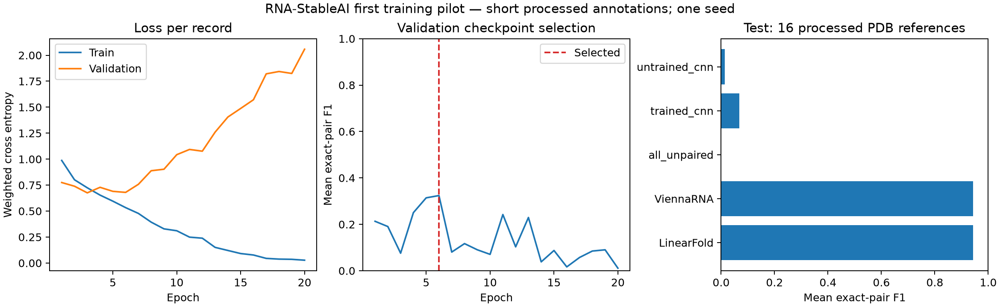

# First experimental-derived evaluation and training checkpoint

Project: RNA-StableAI
Date: 2026-10-05 (America/Los_Angeles)
Workspace: `/home/zyliu/Documents/rna-stable-ai`

The user authorized starting experimental evaluation and training. A separate bounded
CPU secondary-structure baseline was selected as the default after an optional target
question received no reply. No energy surrogate or GPU training was started.

## Data and prospective plan

The local EternaFold archive at commit `87b9aac55cee14fd562049d08f7b92d3131f10ce`
contains PDB-derived RNA STRAND S-Processed annotations. Exact FASTA sequence/metadata
matching confirms the PDB source for each imported BPSEQ record. Every processed pair
is preserved; invalid/ambiguous/crossing-pair records are rejected. This is a comparison
with processed experimental-derived annotations, not raw pair observations. See
[RNA STRAND provenance](https://doi.org/10.1186/1471-2105-9-340) and
[pinned EternaFold source](https://github.com/WaymentSteeleLab/EternaFold/tree/87b9aac55cee14fd562049d08f7b92d3131f10ce).

The newer [Dryad DMS dataset](https://doi.org/10.5061/dryad.79cnp5j95) was investigated
but not acquired: shell DNS failed and the web download returned HTTP 403. No claim
of evaluating that dataset is made.

Configuration, source hashes, import exclusions and train/validation/test snapshots
were frozen before training/test folding at `/home/zyliu/Documents/rna-stable-ai/results/experimental_pilot_runs/20261006T010347.964097Z`. The pilot range was fixed at
20–256 nt. Upstream splits were preserved with test > validation > training priority
for conflict filtering. Only one record per PDB accession is retained; exact sequences
and symmetric SequenceMatcher similarity >=0.8 also trigger exclusion. This heuristic
does not establish family independence or alignment identity.

Retained counts: **41 train / 12 validation / 16 test**; 56 excluded source records.
Actual lengths: training 20–76 nt, validation 21–75 nt, test 21–159 nt.

## Training and results

A separate 10,979-parameter Conv1d model predicts dot/open/close states. Training-only
class weights and a fixed greedy canonical-pair decoder are used. It trained for
20 epochs on CPU with two threads and seed 20261005. Validation F1, then validation
loss, then earliest epoch selected **epoch 6**. The training API has no test input.
Both initial and selected checkpoint state dictionaries are saved and hashed.

All 32 native CPU folds succeeded, and all 80 planned method/reference predictions
were scored on the test split. Mean exact-pair F1:

| Method | Test pair F1 |
|---|---:|
| ViennaRNA | 0.9437729912 |
| LinearFold beam 100 | 0.9437729912 |
| Trained CNN | 0.0674603175 |
| Initial untrained CNN | 0.0131578947 |
| All-unpaired | 0.0000000000 |

The neural baseline falls well short of the folding tools. Loss/validation curves
show strong overfitting. A local three-state model with a greedy decoder cannot be
assumed to capture global pairing. This one-seed, short processed cohort establishes
neither long-RNA accuracy nor biological stability. Legacy folding-tool parameter
training overlap was not established. Do not tune against the observed test results.

## Verification and preserved evidence

**233 tests passed**, including 23 added pilot tests, in
`reports/tests-experimental-checkpoint.xml`. Tests verify BPSEQ conversion/rejection,
exact metadata binding, split conflict filtering, bounded settings, canonical/nested
decoding, actual parameter updates, validation selection, the full saved pilot audit
and checkpoint-corruption rejection without modifying measured artifacts.

The pilot audit passed: upstream data hashes and import reconstruction; every split
snapshot and exclusion; training-only labels/weights; epoch events and checkpoint
selection; independent loaded-checkpoint inference; raw fold sequence/structure/energy
binding; all test scores and reference exports. No training is rerun by the auditor.

The original equal-budget long study also re-audited successfully. Its summary and
manifest hashes are unchanged. Original synthetic measurements and the untrained
throughput encoder remain preserved. No dependency/driver/system changes or GitHub
push were made. Source/status backups: `reports/source_backups/20261006T010000.120440Z/`.
Commands and outputs: `reports/commands.jsonl`.

Standalone diagnostics: `/home/zyliu/Documents/rna-stable-ai/results/experimental_pilot_runs/20261006T010347.964097Z/figures/20261006T010807.239562Z/diagnostics.png`. The figure manifest records source-summary
and PNG hashes; regeneration creates a new figure directory and retains earlier PNGs.



## Continue

Next, design a larger family-separated cohort and a model with global pair scores.
Reserve a new independent test set before any model/hyperparameter tuning; this pilot's
16-record test set has already been inspected. An energy surrogate remains a different
training objective and has not been implemented. Development remains local.

```bash
cd /home/zyliu/Documents/rna-stable-ai
.venv/bin/python scripts/verify_experimental_pilot.py
.venv/bin/python -m pytest -q
.venv/bin/python scripts/plot_experimental_pilot.py
```
