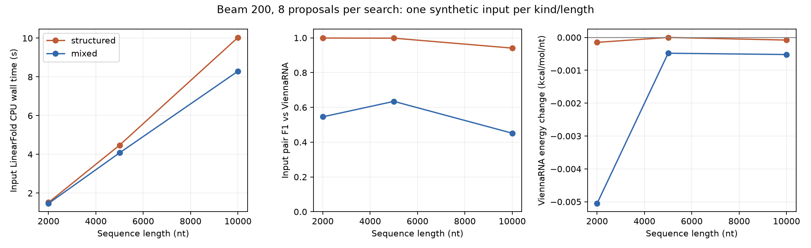

# Long-RNA CPU scaling pilot

Run: `/home/zyliu/Documents/rna-stable-ai/results/sweep_runs/20261004T220959.135824Z`

Completed: 6/6; statuses: {'validated': 6}.

Beam 200; 8 mutation proposals; input seed 1729; search seed 2718. Mutation limit 40 positions. GC and nucleotide counts are preserved. LinearFold timeout 60 s; ViennaRNA timeout 600 s; address-space limit 8 GiB/process.

| Kind | Length | Status | LF seconds | Input Vienna seconds | Final Vienna seconds | Input pair F1 | Finalist pair F1 | LF delta kcal/mol | Vienna delta kcal/mol | Changes |
|---|---:|---|---:|---:|---:|---:|---:|---:|---:|---:|
| structured | 2000 | validated | 1.5179 | 2.7698 | 2.8199 | 0.9988 | 0.9988 | -0.3000 | -0.3000 | 2 |
| mixed | 2000 | validated | 1.4678 | 2.8202 | 2.8202 | 0.5457 | 0.7780 | -16.4000 | -10.1000 | 10 |
| structured | 5000 | validated | 4.4749 | 22.3199 | 0.0000 | 0.9981 | 0.9981 | 0.0000 | 0.0000 | 0 |
| mixed | 5000 | validated | 4.0789 | 22.4250 | 22.4611 | 0.6347 | 0.6537 | -6.4000 | -2.4000 | 8 |
| structured | 10000 | validated | 10.0368 | 123.1194 | 121.2627 | 0.9410 | 0.9410 | -0.8000 | -0.8000 | 2 |
| mixed | 10000 | validated | 8.2937 | 122.2522 | 125.0606 | 0.4516 | 0.6090 | -11.2000 | -5.2000 | 10 |



Negative energy changes mean lower computed MFE, not demonstrated biological stability. Zero finalist validation time means an unchanged sequence reused its input result. Unknown/failed results remain blank. Individual raw folds, mutation histories, hashes and constraints are retained in each job summary.

## Limits and next step

This pilot uses one sequence/search seed per kind and length. No confidence intervals or population claims are supported. Its budget differs from the earlier 24-step 1,000-nt sweep. These are CPU folds; the GPU encoder remains a separate inference baseline. No training was performed.

Next, replicate the long inputs across seeds and application-specific constraints before treating the optimizer as a biological design tool. Keep ViennaRNA validation even when the LinearFold surrogate improves.

```bash
./scripts/rnastable evaluate --config configs/evaluation_long.json
.venv/bin/python scripts/verify_sweep.py
.venv/bin/python scripts/summarize_long.py
```
