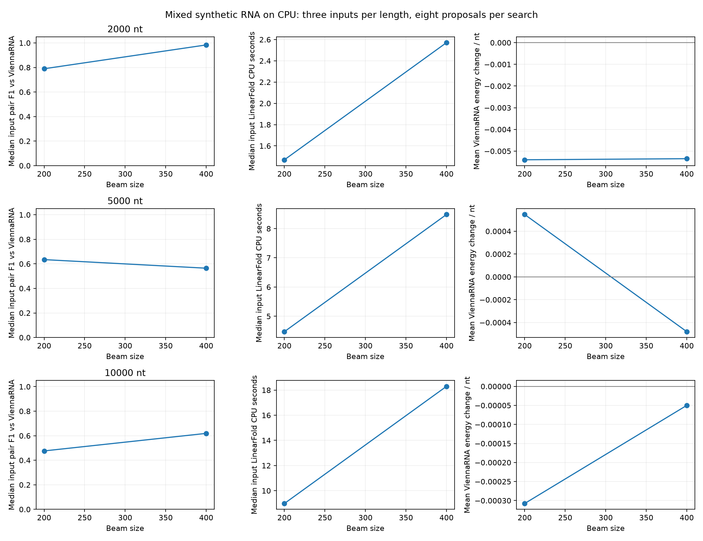

# Long mixed-RNA CPU replication and beam comparison

Run: `/home/zyliu/Documents/rna-stable-ai/results/sweep_runs/20261004T223012.118701Z`

Completed 18/18; statuses: {'validated': 18}.

Three seeded mixed inputs at each length; one search seed; eight mutation proposals per search. Beams 200 and 400 share the exact input and search seed. Search trajectories may diverge. All nucleotide counts, GC content and length are preserved; maximum 40 changed positions. CPU LinearFold timeout 120 s; CPU ViennaRNA validation timeout 600 s; address-space cap 8 GiB/process.

| Length | Beam | Validated / planned | Improved | Unchanged | Worsened | Median input F1 | Median LF seconds | Mean Vienna change / nt |
|---:|---:|---|---:|---:|---:|---:|---:|---:|
| 2000 | 200 | 3/3 | 3 | 0 | 0 | 0.78959 | 1.46923 | -0.00540 |
| 2000 | 400 | 3/3 | 3 | 0 | 0 | 0.98361 | 2.57088 | -0.00535 |
| 5000 | 200 | 3/3 | 1 | 0 | 2 | 0.63466 | 4.47443 | 0.00055 |
| 5000 | 400 | 3/3 | 3 | 0 | 0 | 0.56473 | 8.48163 | -0.00048 |
| 10000 | 200 | 3/3 | 2 | 0 | 1 | 0.47621 | 8.98144 | -0.00031 |
| 10000 | 400 | 3/3 | 2 | 1 | 0 | 0.61905 | 18.29801 | -0.00005 |



## Paired differences: beam 400 minus beam 200

| Length | Input seed | Input F1 change | LF time ratio (400/200) | Vienna change difference kcal/mol |
|---:|---:|---:|---:|---:|
| 2000 | 1729 | -0.13687 | 1.71691 | -1.00000 |
| 2000 | 1730 | 0.12154 | 1.74982 | 0.00000 |
| 2000 | 1731 | 0.20271 | 1.73397 | 1.30000 |
| 5000 | 1729 | 0.30088 | 1.89492 | -0.60000 |
| 5000 | 1730 | -0.27402 | 1.96264 | -4.00000 |
| 5000 | 1731 | -0.06627 | 1.87630 | -10.80000 |
| 10000 | 1729 | 0.09221 | 2.03731 | 5.10000 |
| 10000 | 1730 | 0.13298 | 2.10123 | 2.83000 |
| 10000 | 1731 | 0.14284 | 1.90057 | -0.20000 |

Positive F1 differences indicate closer agreement with ViennaRNA; negative energy differences indicate a larger computed improvement at beam 400. A larger beam is not guaranteed to improve either measure. Failures remain missing and appear in status counts.

## Limits

Three synthetic inputs per length do not establish population performance or biological stability. One search seed does not measure search variability. Timing includes process startup and has no repeated timing trials. Shared ViennaRNA reference timings are not independent measurements. This study covers mixed RNA; structured RNA retains its earlier single-seed pilot. No training was performed.

Retain independent ViennaRNA checks. The next implementation should return the original sequence unless the finalist has a confirmed reference-energy improvement; preserve rejected finalists and all validation failures as evidence. Select a beam only after reviewing agreement, runtime and validated energy together, then test multiple search seeds with annotated application constraints before any training decision.

```bash
./scripts/rnastable evaluate --config configs/evaluation_replication.json
.venv/bin/python scripts/summarize_replication.py
.venv/bin/python scripts/verify_sweep.py --summary results/evaluation_replication_summary.json
.venv/bin/python scripts/verify_replication.py
```
