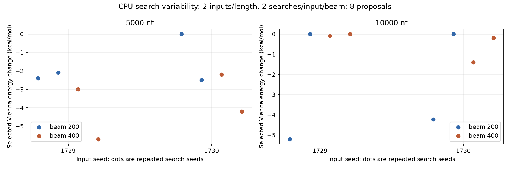

# CPU search-seed robustness study

Run: `/home/zyliu/Documents/rna-stable-ai/results/sweep_runs/20261005T033230.651381Z`

16/16 complete; statuses: {'validated': 16}.

2 mixed input seeds, 2 search seeds per input, paired beams 200/400, 8 proposals/search, mutation cap 40 positions. Each selected output requires independent ViennaRNA improvement. Input references are shared within the run; repeated searches are not independent input samples. CPU folds only; no training.

| Length | Beam | Inputs | Searches | Validated candidates | Selected finalists | Returned inputs | Mean input-mean selected change | SD across input means |
|---:|---:|---:|---:|---:|---:|---:|---:|---:|
| 5000 | 200 | 2 | 4 | 4 | 3 | 1 | -1.7500 | 0.7071 |
| 5000 | 400 | 2 | 4 | 4 | 4 | 0 | -3.7750 | 0.8132 |
| 10000 | 200 | 2 | 4 | 4 | 2 | 2 | -2.3575 | 0.3429 |
| 10000 | 400 | 2 | 4 | 4 | 3 | 1 | -0.4250 | 0.5303 |



## Within-input variation

| Length | Beam | Input seed | Selected / searches | Mean selected change | SD across searches | Best | Worst | Candidate worsenings | Distinct selected sequences |
|---:|---:|---:|---|---:|---:|---:|---:|---:|---:|
| 5000 | 200 | 1729 | 2/2 | -2.2500 | 0.2121 | -2.4000 | -2.1000 | 0 | 2 |
| 5000 | 200 | 1730 | 1/2 | -1.2500 | 1.7678 | -2.5000 | 0.0000 | 1 | 2 |
| 5000 | 400 | 1729 | 2/2 | -4.3500 | 1.9092 | -5.7000 | -3.0000 | 0 | 2 |
| 5000 | 400 | 1730 | 2/2 | -3.2000 | 1.4142 | -4.2000 | -2.2000 | 0 | 2 |
| 10000 | 200 | 1729 | 1/2 | -2.6000 | 3.6770 | -5.2000 | 0.0000 | 1 | 2 |
| 10000 | 200 | 1730 | 1/2 | -2.1150 | 2.9911 | -4.2300 | 0.0000 | 1 | 2 |
| 10000 | 400 | 1729 | 1/2 | -0.0500 | 0.0707 | -0.1000 | 0.0000 | 1 | 2 |
| 10000 | 400 | 1730 | 2/2 | -0.8000 | 0.8485 | -1.4000 | -0.2000 | 0 | 2 |

Energy changes are kcal/mol; lower is better. Candidate worsenings remain visible even though selection returns the input. Unknown measurements stay missing; denominator fields in the CSV expose failures and known selected energies. Group means give each measured input equal weight after averaging its search repeats. Standard deviations are descriptive, not confidence intervals or significance tests.

Only 2 synthetic inputs at each of [5000, 10000] nt were studied. This study does not establish biological stability or generalize to other inputs/lengths. One fold per timing observation includes startup; reference reuse is not repeated timing.

```bash
.venv/bin/python scripts/run_robustness_batches.py --config configs/evaluation_robustness_long.json --workers 2
.venv/bin/python scripts/summarize_robustness.py --config configs/evaluation_robustness_long.json --name robustness_long
.venv/bin/python scripts/verify_robustness.py --summary results/evaluation_robustness_long_summary.json
```


Execution: {"mode": "independent_input_batches", "max_cpu_jobs": 2, "timing_scope": "Concurrent CPU wall times include contention; not isolated benchmark timing."}
Concurrent CPU wall times include contention and must not be compared with isolated folding benchmarks.
