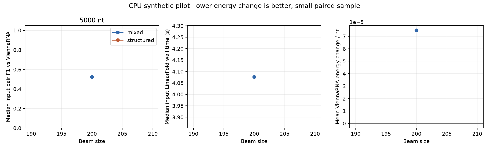

# CPU evaluation sweep

Run: `/home/zyliu/Documents/rna-stable-ai/results/equal_budget_batch_runs/20261005T045331.190725Z/components/mixed_5000_seed1736/results/equal_budget_runs/20261005T045331.295022Z/restarts/results/sweep_runs/20261005T045632.014168Z`

4/4 runs completed; statuses: {'validated': 4}.

Lengths: [5000]; sequence seeds: [1736]; search seeds: [2740, 2741, 2742, 2743]; beam sizes: [200]; proposal budget: 8.

| Kind | Length | Beam | Validated / planned | Improved | Unchanged | Worsened | Median input pair F1 | Median LF seconds | Mean Vienna delta / nt |
|---|---:|---:|---|---:|---:|---:|---:|---:|---:|
| mixed | 5000 | 200 | 4/4 | 3 | 0 | 1 | 0.52438 | 4.07689 | 0.00008 |




Negative ViennaRNA deltas mean lower computed MFE. Independent validation can contradict the LinearFold surrogate. Aggregation is separated by sequence kind, length and beam; unknown results stay missing.

Use each job's selected.fasta as the output: only a confirmed ViennaRNA improvement selects the finalist. Otherwise it contains the original input. Retained finalist scores, failure statuses and aggregate improvement/worsening counts above describe search candidates before selection.

## Limitations

- CPU folding/search only; no neural training.
- Synthetic pilot, not experimental stability validation.
- Beam comparisons share input sequences and search seeds; observations are paired.
- Search seeds repeat the same input, so runs are not independent biological samples.
- Single timed fold per input/beam; startup is included. Reference times are reused, not independent timing replicates.
- Missing validation is excluded from energy averages and exposed in failure counts. No statistical significance claim.

## Resume this run

```bash
./scripts/rnastable evaluate --config /home/zyliu/Documents/rna-stable-ai/results/equal_budget_batch_runs/20261005T045331.190725Z/components/mixed_5000_seed1736/results/equal_budget_runs/20261005T045331.295022Z/restarts/config.json --resume /home/zyliu/Documents/rna-stable-ai/results/equal_budget_batch_runs/20261005T045331.190725Z/components/mixed_5000_seed1736/results/equal_budget_runs/20261005T045331.295022Z/restarts/results/sweep_runs/20261005T045632.014168Z
```
