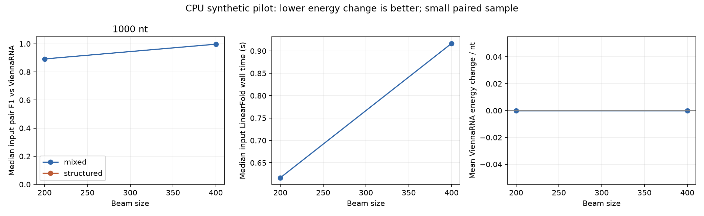

# CPU evaluation sweep

Run: `/home/zyliu/Documents/rna-stable-ai/results/sweep_runs/20261005T035944.651351Z/components/mixed_1000_seed1729/results/sweep_runs/20261005T035944.751616Z`

2/2 runs completed; statuses: {'validated': 2}.

Lengths: [1000]; sequence seeds: [1729]; search seeds: [2718]; beam sizes: [200, 400]; proposal budget: 1.

| Kind | Length | Beam | Validated / planned | Improved | Unchanged | Worsened | Median input pair F1 | Median LF seconds | Mean Vienna delta / nt |
|---|---:|---:|---|---:|---:|---:|---:|---:|---:|
| mixed | 1000 | 200 | 1/1 | 0 | 1 | 0 | 0.89202 | 0.61671 | 0.00000 |
| mixed | 1000 | 400 | 1/1 | 0 | 1 | 0 | 0.99687 | 0.91666 | 0.00000 |




Negative ViennaRNA deltas mean lower computed MFE. Independent validation can contradict the LinearFold surrogate. Aggregation is separated by sequence kind, length and beam; unknown results stay missing.

Use each job's selected.fasta as the output: only a confirmed ViennaRNA improvement selects the finalist. Otherwise it contains the original input. Retained finalist scores, failure statuses and aggregate improvement/worsening counts above describe search candidates before selection.

## Limitations

- CPU folding/search only; no neural training.
- Synthetic pilot, not experimental stability validation.
- Beam comparisons share input sequences and search seeds; observations are paired.
- Search seeds repeat the same input, so runs are not independent biological samples.
- Single timed fold per input/beam; startup is included. Reference times are reused, not independent timing replicates.
- Missing validation is excluded from energy averages and exposed in failure counts. No statistical significance claim.

## Resume this run

```bash
./scripts/rnastable evaluate --config /home/zyliu/Documents/rna-stable-ai/results/sweep_runs/20261005T035944.651351Z/components/mixed_1000_seed1729/config.json --resume /home/zyliu/Documents/rna-stable-ai/results/sweep_runs/20261005T035944.651351Z/components/mixed_1000_seed1729/results/sweep_runs/20261005T035944.751616Z
```
